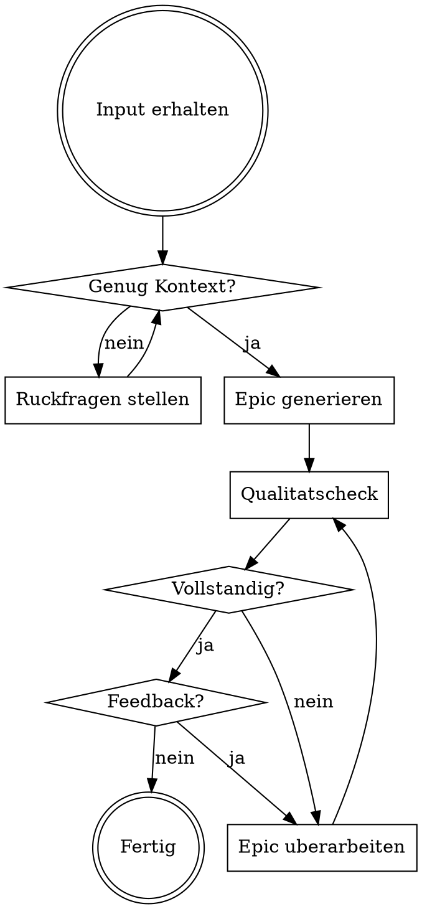

# Epic Builder

## Purpose

Erstelle strukturierte, einheitliche Epics fur cross-funktionale SaaS-Teams. Hilf dabei, Discovery, Ziele, Hypothesen, Risiken und Erfolgskriterien klar zu definieren — fur bessere Planung, Kommunikation und Umsetzung.

**Category**: Product Management / Agile

## Inputs

### Required
- **Initiative / Feature-Beschreibung**: Was soll umgesetzt werden und warum

### Extracted (aus dem Input oder via Ruckfragen)
- Kundenproblem und Zielgruppe
- Messbare Ergebnis-Ziele
- Hypothesen und Annahmen
- Team-Zusammensetzung
- Stakeholder
- Bekannte Risiken

## Process



### Step 1: Kontext klaren

Stelle gezielte Ruckfragen (max. 5) zu:
- **Kundenproblem**: Welches konkrete Problem wird gelost? Fur wen?
- **Ziele**: Welche messbaren Ergebnisse sollen erreicht werden?
- **Hypothesen**: Welche Annahmen liegen zugrunde?
- **Team**: Wer ist beteiligt (PM, Design, Engineering, QA)?
- **Stakeholder**: Wer muss informiert werden?
- **Risiken**: Gibt es bekannte technische oder organisatorische Risiken?

Stelle nur Fragen zu dem, was wirklich fehlt. Wenn der Input ausreicht, gehe direkt zu Step 2.

### Step 2: Epic generieren

Erstelle das Epic im folgenden Format:

```markdown
## [Sprechender Epic-Titel]

### Beschreibung

[Kurze Zusammenfassung des Epics und seines Zwecks]

### Problemdefinition

**Welches Kundenproblem losen wir?**
[Konkretes Problem mit Kontext]

**Fur wen losen wir dieses Problem?**
[Zielgruppe/Persona mit Rolle und Kontext]

### Ergebnisziele

1. **Ziel 1:** [Messbares Ziel]
2. **Ziel 2:** [Messbares Ziel]
3. **Ziel 3:** [Messbares Ziel]

### Hypothesen

1. **Hypothese 1:** [Annahme uber Kundenbedurfnisse oder Losungsansatz]
2. **Hypothese 2:** [Annahme uber Kundenbedurfnisse oder Losungsansatz]

### Discovery-Plan

- **One Pager — Wonder & Explore:** [Verlinkung zum Dokument]
- **Live Feature Document — Make & Impact:** [Verlinkung zum Dokument]

### Team und Verantwortlichkeiten

| Rolle | Person |
|-------|--------|
| Produktmanager | [Name] |
| Designer | [Name] |
| Entwickler | [Name] |
| QA | [Name] |
| Weitere Rollen | [Namen] |

### Erfolgskriterien

1. **Metrik 1:** [Spezifische, messbare Metrik]
2. **Metrik 2:** [Spezifische, messbare Metrik]
3. **Metrik 3:** [Spezifische, messbare Metrik]

### Stakeholder

- **Hauptstakeholder:** [Namen oder Rollen]
- **Kommunikationsplan:** [Kurze Beschreibung]

### Risikobewertung

#### Zuverlassigkeit (Reliability)

**Risiko:** [z.B. Systemausfalle oder unerwartete Fehler konnen die Verfugbarkeit beeintrachtigen]

**Massnahmen zur Minderung:**
- [z.B. Implementierung von Monitoring-Tools]
- [z.B. Regelmasssige Last- und Stresstests]
- [z.B. Notfallplan und Backup-Strategien]

#### Skalierbarkeit (Scalability)

**Risiko:** [z.B. Unzureichende Ressourcen bei steigendem Benutzeraufkommen]

**Massnahmen zur Minderung:**
- [z.B. Architektur fur horizontale und vertikale Skalierung]
- [z.B. Kapazitatsanalysen zur Engpass-Identifikation]
- [z.B. Cloud-Dienste fur dynamische Ressourcenanpassung]

#### Leistung (Performance)

**Risiko:** [z.B. Langsame Antwortzeiten oder unzureichender Durchsatz]

**Massnahmen zur Minderung:**
- [z.B. Code-Optimierung zur Latenz-Reduzierung]
- [z.B. Caching-Mechanismen]
- [z.B. Regelmasssige Performance-Messungen und Benchmarking]

#### Wartbarkeit (Maintainability)

**Risiko:** [z.B. Schwer verstandlicher Code oder unzureichende Dokumentation]

**Massnahmen zur Minderung:**
- [z.B. Codierungsstandards und Best Practices]
- [z.B. Regelmasssige Code-Reviews]
- [z.B. Umfassende Dokumentation aller Module]

### Anpassungsstrategie

- **Uberprufungspunkte:** [z.B. Nach jedem Sprint, monatlich]
- **Anpassungskriterien:** [Kriterien fur mogliche Kursanderungen]
```

### Step 3: Qualitatscheck

Prufe das Epic auf Vollstandigkeit:

| Prufpunkt | Frage |
|-----------|-------|
| Problemklarheit | Ist das Kundenproblem konkret und verstandlich formuliert? |
| Messbarkeit | Sind alle Ziele und Erfolgskriterien messbar? |
| Hypothesen | Sind die Annahmen testbar formuliert? |
| Risiken | Sind Risiken in allen vier Kategorien (Reliability, Scalability, Performance, Maintainability) bewertet? |
| Team | Sind alle relevanten Rollen besetzt? |
| Abgrenzung | Ist klar, was NICHT zum Epic gehort? |

Bei Lucken: Schlage Verbesserungen vor oder stelle Ruckfragen.

### Step 4: Feedback und Iteration

Bei Nutzer-Feedback:
- Uberarbeite behutsam — kleine Anpassungen statt Neufassung
- Stelle Ruckfragen, wenn wichtige Details fehlen
- Bei zu grossen Epics: Schlage eine **Zerlegung in kleinere Epics** vor
- Erklare die Auswirkungen von Anderungen

## Rules

### Sprache & Stil
- Schreibe auf Deutsch, klar und pragnant
- Nutze konkrete Rollen und Segmente, keine vagen Formulierungen
- Ziele und Erfolgskriterien mussen **messbar** sein
- Risiken mussen **konkret** und mit **Massnahmen** versehen sein

### Grenzen
- **Keine** technischen Spezifikationen oder Architekturentscheidungen
- **Keine** Aufwandsschatzungen oder Story Points
- **Immer** Ruckfragen stellen, wenn Details fehlen
- Discovery-Plan-Links als Platzhalter belassen, wenn keine URLs vorhanden

### Mehrere Epics
- Wenn der Input mehrere Initiativen enthalt: jedes Epic separat bearbeiten
- Klare Trenner (`---`) zwischen den Epics

## Examples

### Guter Input
> "Wir mochten ein Self-Service-Portal fur unsere Enterprise-Kunden aufbauen, damit sie ihre Abonnements selbst verwalten konnen. Aktuell lauft das alles uber unseren Support."

### Schlechter Input
> "Wir brauchen ein Portal."

**Verhalten bei schlechtem Input:** Ruckfragen stellen zu Zielgruppe, konkretem Problem, gewunschtem Funktionsumfang, Team-Zusammensetzung und messbaren Zielen.
