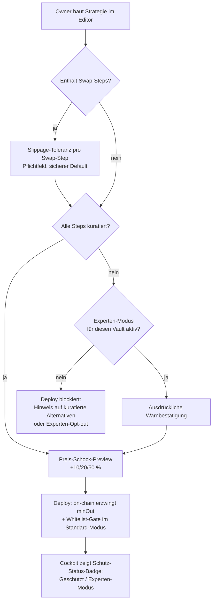

## Description

<!-- SECTION:DESCRIPTION:BEGIN -->
---
created: 2026-07-27
last_verified: 2026-07-27
git_commit: d2243f1
status: eingefroren
version: 2
modus: solo
ticket: TASK-11
---

# Epic: Absicherungs-Paket

> **v2 (2026-07-27): A5 gestrichen, Verbot 5 entfallen — Grund:** Produkt ist nicht live;
> die aktuellen Deployments dürfen frei geändert werden (Entscheidung Florian, Station-2-
> Klärung). Der Whitelist-Check wandert direkt in den bestehenden Vault-Contract statt in
> eine V2-Version; eine Bestands-Migrations-Mechanik wird erst mit dem Mainnet-Launch
> relevant (v-next). Historie: Freigabe-Quittung.

## Einseiter

Vault-Owner können heute Strategien bauen, deren Swaps ohne Slippage-Schutz laufen und deren
Vault beliebige, unkuratierte delegatecall-Targets akzeptiert — zwei dokumentierte Lücken,
die im schlimmsten Fall Nutzer-Gelder vernichten. Ziel: Standard-Deploys sind ab diesem Epic
strukturell geschützt (Pflicht-minOut, kuratierte Whitelist, Preis-Schock-Preview), ohne die
Self-Custody-Freiheit aufzugeben (Experten-Opt-out). Messbar gelöst, wenn (a) kein Swap-Step
über die neuen Action-Versionen ohne wirksames minOut ausführbar ist, (b) Standard-Deploys
ausschließlich kuratierte Actions zulassen und (c) der externe Audit (Ende H1) beide
Lücken-Klassen ohne Critical-Finding bestätigt. (Details: `problem-statement.md`.)

## Ablauf (Bild)
<!-- Konsument: Abnahme-Frage vor fachlichAbgenommen, Ticket-Rendering; Erzeuger: Skill diagramm -->

## Personas & Rollen-/Rechte-Matrix

| Rolle | darf sehen/tun | um zu erreichen |
|---|---|---|
| Vault-Owner (Standard) | nur kuratierte Actions/Conditions deployen; Slippage-Toleranz pro Swap-Step setzen (sicherer Default); Preis-Schock-Preview sehen | geschützt automatisieren, ohne Contract-Detailwissen |
| Vault-Owner (Experten-Modus) | pro Vault Opt-out aktivieren (ausdrückliche Warnbestätigung) → beliebige Targets deploybar | volle Self-Custody-Freiheit behalten |
| Kurator (3Blocks-Rolle) | kuratierte Action-/Condition-Liste pflegen (aufnehmen/entfernen); Aufnahme nur nach Code-Review + Fork-Tests | Schutz-Standard aktuell halten |
| Keeper/Executor | unverändert — führt nur bei erfülltem Trigger aus | bestehendes Verhalten |
| KI-Assistent (MCP) | unterliegt denselben Regeln wie der Standard-Owner (kein propose ohne Schutz) | Assistent kann Schutz nie umgehen |

Altersspanne: 18+ (DeFi-Nutzer) · Nicht-Zielgruppe: Verwahr-Kunden (Custodial) — Produkt bleibt Self-Custody.

## Fachliche Regeln & Verbotsliste

1. Ein Swap-Step ohne wirksames minOut darf über die neuen Action-Versionen NIE ausführbar sein — auch nicht per direktem Contract-Call.
2. Im Standard-Modus darf NIE ein unkuratiertes delegatecall-Target deploybar sein.
3. Der Experten-Opt-out darf NIE still aktiv werden — immer ausdrückliche, pro Vault dokumentierte Bestätigung.
4. Der KI-Assistent darf die Schutzregeln NIE umgehen (PolicyGate erzwingt sie serverseitig).
5. *(v2 entfallen — Bestands-Kennzeichnung erst mit Mainnet-Launch relevant.)*
6. Bestehende Vaults/Gelder dürfen durch die Einführung NIE blockiert werden (lokale Bestands-Vaults laufen unverändert weiter, bis neu deployt wird).

## Plattform-Familie

Bestehende Web-DApp (Vite/React) + On-Chain-Contracts (BSC) + MCP-Server — keine neue Plattform. Kein Offline-/Geräte-Zugriff nötig.

## Monetarisierung

Nicht relevant für dieses Epic — es schafft die Vertrauens-Voraussetzung für die spätere Monetarisierung (Fee-Epic B), verdient selbst kein Geld.

## Zu integrierende Dienste/Systeme

Keine neuen externen Dienste. Intern: bestehender Preis-Oracle-Pfad für die Preis-Schock-Preview; bestehende Action-/Condition-Registries als Verankerungspunkt der Kuratierung.

## Kritikalität (zwei Fragen)

1. Darf die App mal kurz weg sein? → Die App ja; die On-Chain-Schutzregeln nie (sie wirken unabhängig vom Backend).
2. Dutzende oder Tausende Nutzer? → Heute Dutzende (Power-User-Phase), ausgelegt auf Tausende.

## Rahmen-Angaben

Branche: DeFi/Krypto (BSC) · Personenbezogene Daten: keine neuen (nur Wallet-Adressen wie bisher) · Sprachen: UI Englisch (bestehend) · Kontaktkanal: bestehende Kanäle · Heutige Behelfslösungen: siehe Problem Statement · LLM-Anteil: keiner neu (MCP-Regeln werden nur nachgezogen).

## Erscheinungsbild

Bestehendes Design-System der DApp; keine neue Design-Richtung. Badge/Warnungen folgen den vorhandenen Status-Mustern. (Prototyp-Gate entfällt: kein neuer UI-Paradigmen-Anteil — neue Felder/Badges rendern über das bestehende schema-getriebene Formular- und Cockpit-Muster; regelbasiert dokumentiert.)

## Anforderungen

### A1 — Slippage-Schutz für Swap-Actions (Muss)
- Rolle: Vault-Owner (Standard + Experte)
- Fähigkeit: Für jeden Swap-Step eine Slippage-Toleranz setzen (Pflichtfeld, sicherer Default), die on-chain als minOut erzwungen wird.
- Zweck: Sandwich-/Slippage-Verluste auf das explizit akzeptierte Maß begrenzen.
- Fachliche Kriterien: Normalfall: Deploy mit Default-Toleranz, Ausführung revertiert bei Unterschreitung. Randfälle: sehr illiquide Pools (Preview warnt), Toleranz-Grenzwerte (Min/Max validiert im Editor wie on-chain); TWAP nicht verfügbar → Fallback auf Spot-Preis mit engerer Toleranz (v2-Klärung Station 2). Fehlerfälle: Ausführung mit verletztem minOut revertiert mit klarer Fehlermeldung.

### A2 — Kuratierte Action-/Condition-Whitelist (Muss)
- Rolle: Vault-Owner (Standard); Kurator
- Fähigkeit: Standard-Deploys akzeptieren ausschließlich kuratierte Actions/Conditions; der Kurator pflegt die Liste on-chain (eigene Rolle, Aufnahme nur nach Code-Review + Fork-Tests, Entfernen wirkt nur auf neue Deploys).
- Zweck: Den Pfad „bösartige Action überschreibt Vault-Storage" für Standard-Nutzer schließen.
- Fachliche Kriterien: Normalfall: alle Katalog-Steps sind kuratiert, Deploy unverändert. Randfälle: Entfernen einer Action stoppt keine laufenden Automationen; Bestands-Vaults bleiben funktionsfähig. Fehlerfälle: Deploy mit unkuratiertem Target im Standard-Modus wird abgelehnt (on-chain + Editor + MCP konsistent, eine Regelquelle).

### A3 — Experten-Opt-out pro Vault (Muss)
- Rolle: Vault-Owner (Experte)
- Fähigkeit: Pro Vault den Experten-Modus mit ausdrücklicher Warnbestätigung aktivieren; danach sind beliebige Targets deploybar.
- Zweck: Self-Custody-Freiheit erhalten, ohne den Standard-Schutz zu verwässern.
- Fachliche Kriterien: Normalfall: Aktivierung dokumentiert (on-chain nachvollziehbar), Badge wechselt auf „Experten-Modus". Randfälle: Deaktivierung wieder möglich (wirkt auf neue Deploys). Fehlerfälle: Aktivierung ohne Bestätigungs-Interaktion ist unmöglich (Verbot 3).

### A4 — Preis-Schock-Preview im Deploy-Dialog (Muss)
- Rolle: Vault-Owner
- Fähigkeit: Vor dem Deploy sehen, wie sich die Strategie-Positionen bei ±10/20/50 % Preisbewegung rechnerisch verhalten (keine historischen Daten, kein Dry-Run).
- Zweck: Risiko vor dem Absenden greifbar machen.
- Fachliche Kriterien: Normalfall: Preview für Steps mit Preis-Exposure (Swaps, LP-Ranges, Lending-HF). Randfälle: fehlender Preis → „Preview nicht verfügbar" statt Blockade. Fehlerfälle: Preview-Fehler verhindert nie den Deploy (Anzeige degradiert, Verbot 6 sinngemäß).

### A5 — *(v2 gestrichen)* Bestands-Kennzeichnung + Ein-Klick-Migration
Entfallen in v2: Produkt nicht live, Deployments frei änderbar — Migrations-/Kennzeichnungs-Mechanik wird erst mit dem Mainnet-Launch relevant (v-next). ID bleibt reserviert.

### A6 — Schutz-Status-Badge im Cockpit (Kann)
- Rolle: Vault-Owner
- Fähigkeit: Pro Vault den Status „Geschützt / Experten-Modus" auf einen Blick sehen.
- Zweck: Den Schutz sichtbar machen (Vertrauens-Signal).
- Fachliche Kriterien: Normalfall: Badge aus On-Chain-/Katalog-Zustand abgeleitet. Fehlerfälle: unklarer Zustand → konservativste Anzeige.

## Out of Scope / v-next

- Bestands-Kennzeichnung + Migrations-Mechanik (ex-A5) — v-next, erst mit Mainnet-Launch relevant.
- Panik-Withdraw (Ein-Klick-Notausstieg) — v-next.
- Dry-Run auf Fork / historisches Backtesting — v-next (Kandidat H2/H3).
- Stop-Loss-/HF-Wächter-Steps — Epic E (Strategie-Bausteine, H2).
- Explizite MCP-PolicyGate-Zusatzhärtung als eigene Anforderung — v-next (Regel 4 deckt das Verhalten bereits ab).
- DAO-/Community-Kuratierung — v-next.

## Annahmen & offene Fragen

1. *(v2 aufgelöst, Station-2-Klärung):* Whitelist-Check direkt im bestehenden Vault-Contract (`createAutomation`-Gate gegen CuratedRegistry + Experten-Flag) — kein V2-Versionierungs-Weg nötig, da Produkt nicht live und Deployments frei änderbar.
2. *(v2 aufgelöst, Station-2-Klärung):* minOut-Referenz = Pool-TWAP zur Ausführungszeit; bei nicht verfügbarem observe() Fallback auf Spot-Preis mit engerer Toleranz. Bewusster Trade-off: Verfügbarkeit vor maximaler Manipulationsresistenz im Fallback-Pfad (dokumentiert im PRD).
3. Annahme: Produkt bleibt bis zum Abschluss dieses Epics nicht live auf Mainnet — Contract-Änderungen ohne Migrationspfad sind zulässig.
4. Annahme: Kuratierungs-Prozess (Review + Fork-Tests) ist mit Solo-/Kleinteam-Kapazität leistbar; Durchlaufzeit pro neuer Action unkritisch in H1.

---
Freeze-Commit v2: bd2b11fc119c35fdbdbf9ab0e6943a7b721e78a6 · Quelle: docs/discovery/absicherungs-paket/epic.md
<!-- SECTION:DESCRIPTION:END -->
